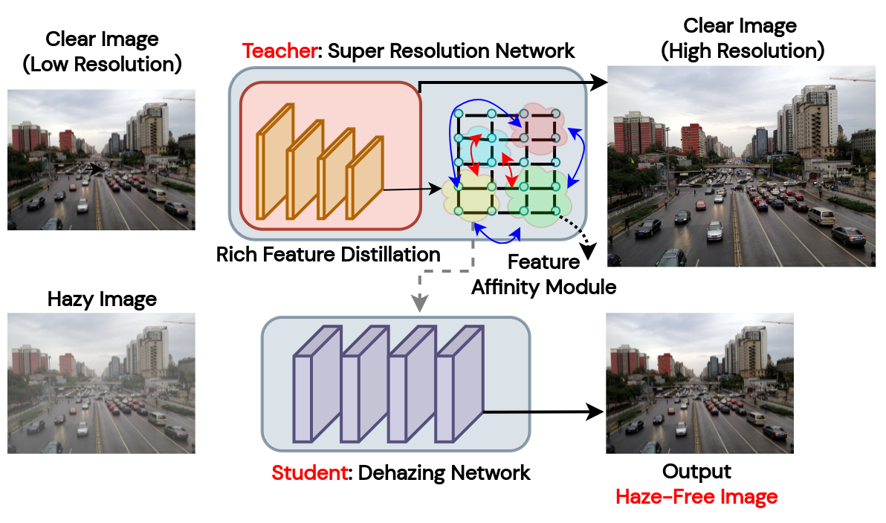

# Rich Teacher Features for Efficient Single-Image Haze Removal

**PyTorch Implementation of**  
**_"Rich Teacher Features for Efficient Single-Image Haze Removal"_**

This repository provides an efficient and lightweight framework for single-image dehazing, leveraging **heterogeneous knowledge distillation** from a lightweight **super-resolution teacher model** to guide a compact **student dehazing network**.  
The method is simple yet effective, designed specifically for **on-the-edge deployment** where computational resources are limited.

  

---

## 📄 Paper

> [Rich Teacher Features for Efficient Single-Image Haze Removal](https://arxiv.org/pdf/2207.11250)

**Abstract:**  
Single-image haze removal is a long-standing hurdle for computer vision applications.  
Several works have focused on transferring advances from **image classification**, **detection**, and **segmentation** to the niche of **image dehazing**, primarily focusing on **contrastive learning** and **knowledge distillation**. However, these approaches prove **computationally expensive**, raising concern regarding their applicability to **on-the-edge use-cases**. This work introduces a **simple**, **lightweight**, and **efficient framework** for **single-image haze removal**, exploiting rich **"dark knowledge"** information from a **lightweight pre-trained super-resolution model** via the notion of **heterogeneous knowledge distillation**. We designed a **Feature Affinity Module** to maximize the flow of rich feature semantics from the **super-resolution teacher** to the **student dehazing network**. In order to evaluate the efficacy of our proposed framework, its performance as a **plug-and-play setup** to a **baseline model** is examined. Our experiments are carried out on the **RESIDE-Standard dataset** to demonstrate the robustness of our framework to both **synthetic** and **real-world domains**. The extensive **qualitative and quantitative results** provided establish the effectiveness of the framework, achieving gains of up to **15% (PSNR)** while reducing the model size by approximately **20×**.